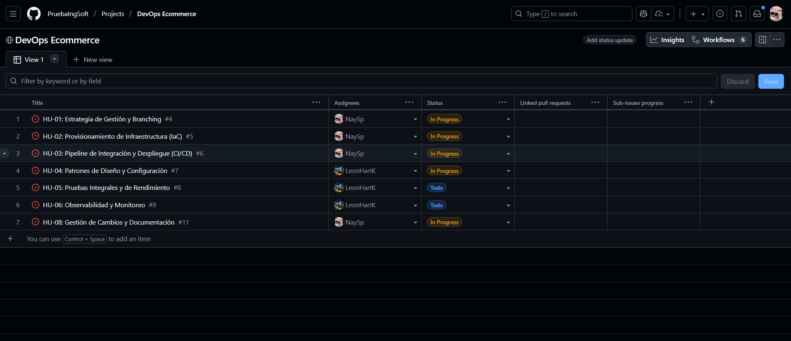
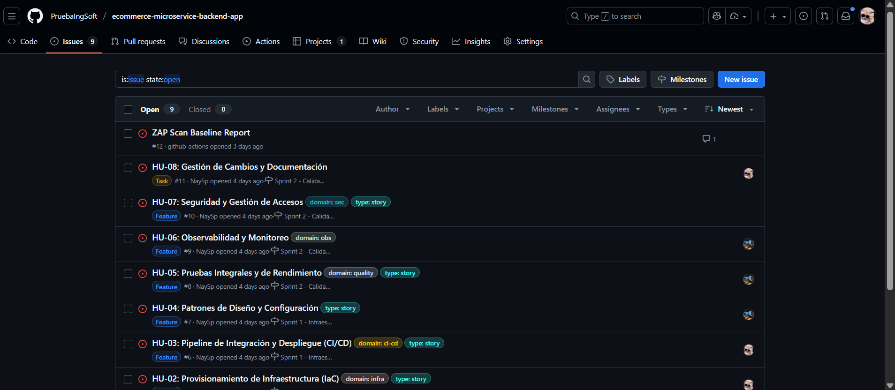
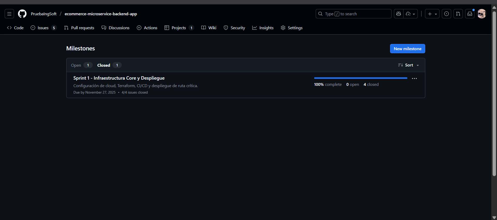
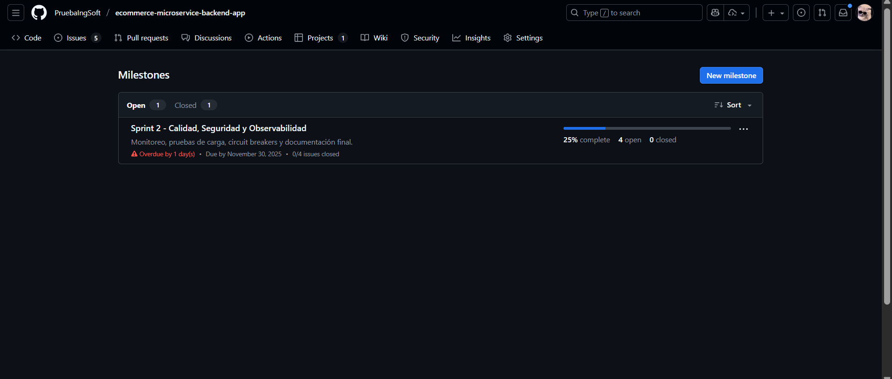
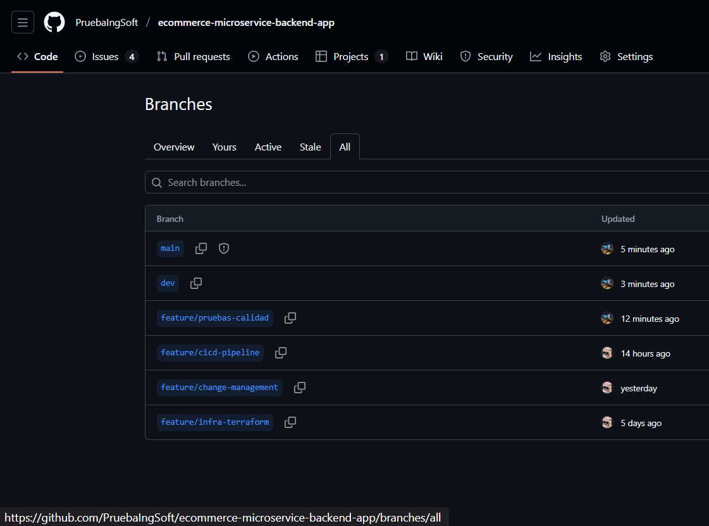

# 1. Metodología y Gestión del Proyecto

## 1.1 Marco de Trabajo Ágil

Para el desarrollo del proyecto se implementó una adaptación de **Scrum** ajustada al contexto de un equipo reducido de 2 personas, manteniendo los principios ágiles pero simplificando ceremonias y roles.

**Elementos de Scrum implementados:**
- **Sprints:** Iteraciones de duración fija (3-4 días) con objetivos específicos y entregables concretos
- **Product Backlog:** Lista priorizada de historias de usuario gestionada en GitHub Issues
- **Sprint Planning:** Sesión breve al inicio de cada sprint para definir alcance y distribución de trabajo
- **Sprint Review:** Validación de entregables al cierre del sprint mediante merge a rama principal
- **Sprint Retrospective:** Análisis conjunto de aspectos positivos, problemas encontrados y acciones de mejora
- **Roles compartidos:** Ambos miembros actuaron como desarrolladores full-stack con responsabilidades en infraestructura, CI/CD, seguridad y documentación

**Adaptaciones para nuestro equipo de 2 personas:**
- Ceremonias simplificadas sin reuniones diarias formales, comunicación continua mediante chat y pair programming o discord
- Revisiones de código cruzadas entre ambos miembros antes de cada merge
- Distribución de historias de usuario según expertise: uno enfocado en infraestructura/Terraform, otro en pipelines/seguridad o en pruebas/patrones
- Documentación colaborativa con revisión mutua de secciones técnicas

---

## 1.2 Sistema de Gestión de Proyectos Ágiles

Se utilizó **GitHub Projects** como herramienta de gestión ágil, integrando directamente con el repositorio de código para mantener trazabilidad completa entre issues, pull requests y despliegues.

**Configuración del proyecto:**

**Estructura de Milestones:**
Se crearon 2 milestones correspondientes a los sprints planificados, cada uno con fecha de cierre definida y conjunto de issues asignados.

- **Sprint 1:** Infraestructura Core y Despliegue (cierre: 27 de noviembre)
- **Sprint 2:** Calidad, Seguridad y Observabilidad (cierre: 30 de noviembre)

**Tablero Kanban:**
Se implementó un tablero con tres columnas representando el flujo de trabajo: `Todo` → `In Progress` → `Done`.

Este tablero permitió visualizar en tiempo real el estado de cada historia de usuario y facilitar la identificación de bloqueos o acumulación de trabajo en alguna fase del desarrollo.

**Gestión de Issues:**
Cada historia de usuario se registró como issue en GitHub con labels para clasificación por dominio (infra, ci-cd, security, quality, obs) y tipo (story, task, feature).

Los issues incluyen:
- Descripción detallada de la historia de usuario
- Criterios de aceptación específicos
- Asignación a milestone correspondiente
- Labels de clasificación (dominio y tipo)
- Referencias cruzadas a pull requests relacionados

**Ventajas de GitHub Projects para este proyecto:**
- Integración nativa con el código y pipelines de CI/CD
- Trazabilidad automática entre commits, PRs e issues
- Visibilidad del estado del proyecto sin necesidad de herramientas externas
- Automatización de movimiento de issues según estado de PR (open, merged, closed)

---

## 1.3 Estrategia de Branching (GitFlow)

Se adoptó **GitFlow** como estrategia de branching para garantizar la estabilidad del código en producción y permitir desarrollo paralelo de funcionalidades.

**Estructura de ramas:**

1. **`main`:** Rama de producción que refleja el estado actual del sistema en ambiente productivo. Protegida con revisiones obligatorias y checks automáticos.

2. **`dev`:** Rama de integración donde convergen todas las funcionalidades completadas antes de promoción a producción. Despliegue automático a namespace dev en AKS.

3. **`feature/<nombre>`:** Ramas efímeras creadas desde dev para desarrollo de historias de usuario específicas. Se eliminan después del merge.

**Flujo de trabajo:**
1. Crear rama feature desde dev para nueva funcionalidad
2. Desarrollo y commits en rama feature
3. Abrir Pull Request hacia dev con template estandarizado
4. Revisión de código y validación de pipelines CI
5. Merge a dev tras aprobación, activando despliegue automático
6. Validación en ambiente dev
7. Pull Request de dev a main para promoción a producción
8. Aprobación manual requerida (GitHub Environment)
9. Despliegue a producción y creación automática de release

**Políticas de protección implementadas:**
- Rama main requiere al menos 1 revisión aprobada
- Rama main requiere checks de CI pasando exitosamente
- No se permite push directo, solo mediante pull request
- Histórico lineal mediante squash merge

---

## 1.4 Gestión de Cambios

La gestión de cambios se automatizó mediante pipelines de CI/CD integrados con el flujo de GitFlow:

- **Pull Requests:** Todo cambio debe pasar por revisión mediante PR con template que documenta tipo de cambio, tests realizados y checklist de calidad
- **Release Management:** Cada merge a main genera automáticamente un release en GitHub con tag semántico y release notes
- **Versionado:** Se utiliza Semantic Versioning para identificar releases

Ver documento `CHANGE_MANAGEMENT.md` para mayor detalle sobre el proceso completo de gestión de cambios.

---

## 1.5 Planificación y Ejecución de Sprints

### Sprint 1: Infraestructura Core y Despliegue
**Período:** Lunes 25 de noviembre - Miércoles 27 de noviembre, 2025  
**Duración:** 3 días  
**Objetivo:** Configuración de cloud, Terraform, CI/CD y despliegue de ruta crítica

#### Historias de Usuario

**HU-01: Estrategia de Gestión y Branching** (#4)  
*Tipo:* Task | *Dominio:* Infraestructura | *Estado:* Closed  
*Asignado a:* Ambos miembros

Como equipo de desarrollo necesitamos definir una estrategia clara de gestión de código y branching para trabajar de forma ordenada y prevenir conflictos.

*Criterios de aceptación:*
- Implementar GitFlow con ramas main, dev y feature/*
- Configurar protección de rama main con revisiones obligatorias
- Definir política de commits y mensajes descriptivos
- Documentar flujo de trabajo en repositorio

*Resultado:* Estrategia GitFlow implementada con protección en rama main. Ambos miembros configuraron protección de ramas y documentaron el flujo de trabajo.

---

**HU-02: Provisionamiento de Infraestructura (IaC)** (#5)  
*Tipo:* Story | *Dominio:* Infraestructura (Terraform/Cloud) | *Estado:* Closed  
*Responsable principal:* Miembro 1

Como equipo necesitamos provisionar toda la infraestructura necesaria usando Terraform para garantizar reproducibilidad y versionamiento de la configuración.

*Criterios de aceptación:*
- Crear módulos Terraform para AKS, ACR, Networking y Database
- Provisionar cluster AKS con 2 nodos Standard_B2s en Azure West US
- Configurar backend remoto en Azure Storage Account para estado compartido
- Implementar estructura modular reutilizable para múltiples ambientes
- Crear namespaces dev y prod en Kubernetes

*Resultado:* Infraestructura completa provisionada. Miembro 1 desarrolló módulos Terraform y configuró Azure, Miembro 2 revisó configuración y validó despliegue en AKS.

---

**HU-03: Pipeline de Integración y Despliegue (CI/CD)** (#6)  
*Tipo:* Story | *Dominio:* CI/CD (Pipelines/GitHub Actions) | *Estado:* Closed  
*Responsable principal:* Miembro 2

Como equipo necesitamos pipelines automatizados que validen el código en cada cambio y desplieguen automáticamente a los ambientes correspondientes.

*Criterios de aceptación:*
- Implementar pipeline CI que ejecute en cada push y pull request
- Incluir compilación, ejecución de tests unitarios y análisis de seguridad
- Crear pipeline de despliegue automático a dev al mergear a rama dev
- Configurar pipeline de despliegue a producción con aprobación manual
- Integrar health checks y validación post-despliegue

*Resultado:* Pipelines CI/CD funcionales. Miembro 2 implementó workflows de GitHub Actions, Miembro 1 configuró secrets y validó integración con AKS.

---

**HU-05: Pruebas Integrales y de Rendimiento** (#8)  
*Tipo:* Story | *Dominio:* Calidad (Pruebas/Locust) | *Estado:* Closed  
*Trabajo colaborativo:* Ambos miembros

Como equipo necesitamos ejecutar pruebas integrales y de carga para validar el funcionamiento del sistema bajo condiciones reales.

*Criterios de aceptación:*
- Configurar pruebas de integración entre microservicios
- Implementar suite de pruebas de carga con Locust
- Validar tiempos de respuesta bajo diferentes cargas
- Documentar resultados y umbrales aceptables

*Resultado:* Suite de pruebas implementada colaborativamente. Miembro 1 configuró Locust, Miembro 2 ejecutó pruebas y documentó resultados.

---

**Métricas del Sprint 1:**
- Historias completadas: 4/4 (100%)
- Issues cerrados: 4
- Duración real: 3 días
- Bloqueos: Ninguno
- Deuda técnica generada: Ninguna

**Entregables:**
- Cluster AKS operativo con infraestructura completa
- Pipelines CI/CD funcionales
- Código en producción mediante merge aprobado
- Pruebas de carga ejecutadas exitosamente

---

### Sprint 2: Calidad, Seguridad y Observabilidad
**Período:** Miércoles 27 de noviembre - Domingo 30 de noviembre, 2025  
**Duración:** 4 días  
**Objetivo:** Monitoreo, pruebas de carga, circuit breakers y documentación final

#### Historias de Usuario

**HU-07: Seguridad y Gestión de Accesos** (#10)  
*Tipo:* Story | *Dominio:* Seguridad (Seguridad/Trivy) | *Estado:* Closed  
*Responsable principal:* Miembro 2

Como equipo necesitamos implementar controles de seguridad en el ciclo de desarrollo para detectar vulnerabilidades antes de llegar a producción.

*Criterios de aceptación:*
- Integrar Trivy en pipeline CI para escaneo de imágenes Docker
- Configurar escaneo de vulnerabilidades HIGH y CRITICAL como bloqueantes
- Implementar análisis de código estático con SonarCloud
- Configurar Quality Gates con umbrales de cobertura y duplicación
- Generar reportes SARIF para seguimiento

*Resultado:* Miembro 2 integró Trivy y SonarCloud en pipelines. Miembro 1 validó configuración y ajustó umbrales de Quality Gate.

---

**HU-04: Patrones de Diseño y Configuración** (#7)  
*Tipo:* Story | *Dominio:* Arquitectura | *Estado:* Open  
*Responsable principal:* Miembro 1

Como equipo necesitamos documentar los patrones de diseño implementados y las configuraciones de los microservicios para facilitar el mantenimiento.

*Criterios de aceptación:*
- Documentar patrones implementados (API Gateway, Service Discovery, Config Server)
- Explicar estrategia de circuit breakers y resilencia
- Documentar configuración de cada microservicio
- Crear diagramas de arquitectura con relaciones entre servicios

*Resultado:* En progreso. Documentación de patrones y diagramas de arquitectura en desarrollo.

---

**HU-06: Observabilidad y Monitoreo** (#9)  
*Tipo:* Story | *Dominio:* Observabilidad (Monitoreo/Grafana) | *Estado:* Open  
*Responsable principal:* Miembro 2

Como equipo necesitamos implementar herramientas de observabilidad para monitorear el estado del sistema en tiempo real.

*Criterios de aceptación:*
- Configurar Zipkin para distributed tracing
- Implementar métricas con Prometheus y visualización en Grafana
- Configurar alertas para condiciones críticas
- Documentar dashboards y queries relevantes

*Resultado:* En progreso. Zipkin desplegado y funcional. Configuración de Prometheus y Grafana pendiente.

---

**HU-08: Gestión de Cambios y Documentación** (#11)  
*Tipo:* Task | *Dominio:* Documentación | *Estado:* Open  
*Trabajo colaborativo:* Ambos miembros

Como equipo necesitamos documentar todo el proceso de desarrollo, decisiones técnicas y procedimientos para cumplir con los requisitos de entrega del proyecto.

*Criterios de aceptación:*
- Crear documentación de metodología ágil y sprints
- Documentar infraestructura y decisiones de arquitectura FinOps
- Explicar estrategia de CI/CD y calidad
- Documentar seguridad y observabilidad
- Incluir diagramas y evidencias visuales

*Resultado:* En progreso. Miembro 1 trabajando en infraestructura y FinOps, Miembro 2 en CI/CD y seguridad. Revisión cruzada de ambas secciones.

---

**Métricas del Sprint 2:**
- Historias completadas: 1/4 (25%)
- Historias en progreso: 3/4 (75%)
- Issues cerrados: 1
- Issues abiertos: 3
- Duración: 4 días 
- Bloqueos: Ninguno identificado

**Entregables proyectados:**
- Sistema de seguridad con análisis estático integrado
- Documentación técnica completa
- Observabilidad básica con tracing distribuido
- Patrones de arquitectura documentados

---

## 1.6 Retrospectiva de Sprints

### Sprint 1: Infraestructura Core y Despliegue

**Aspectos positivos:**
- La estructura modular de Terraform permitió que ambos miembros trabajaran en paralelo sin conflictos de código
- El uso de namespaces para separar ambientes redujo significativamente los costos operativos y simplificó la gestión con un equipo pequeño
- La configuración de backend remoto desde el inicio facilitó el trabajo colaborativo sin problemas de sincronización de estado
- Las revisiones cruzadas de código mejoraron la calidad y compartieron conocimiento entre ambos miembros

**Desafíos enfrentados:**
- Los nodos Standard_B2s inicialmente generaron errores OOMKilled debido a que no consideramos el overhead de 11 microservicios simultáneos
- La curva de aprendizaje de Azure tomó tiempo adicional al no tener experiencia previa con la plataforma
- La coordinación de horarios para trabajar en simultaneo fue complicada por compromisos académicos simultáneos

**Acciones correctivas aplicadas:**
- Ajustamos los límites de memoria después de analizar logs de Kubernetes y pruebas iterativas
- Documentamos los aprendizajes clave de Azure para referencia futura
- Establecimos bloques de tiempo específicos para trabajo sincrónico y asincrónico con comunicación por chat

---

### Sprint 2: Calidad, Seguridad y Observabilidad

**Aspectos positivos:**
- La división de responsabilidades por expertise aceleró el desarrollo
- Las aprobaciones manuales obligaron a ambos miembros a revisar cambios críticos antes de producción
- SonarCloud detectó issues que ninguno había identificado en revisión manual o no habíamos tenido en cuenta

**Desafíos enfrentados:**
- La configuración de ELK stack requirió múltiples intentos y búsqueda de documentación externa
- El tiempo estimado para documentación fue insuficiente al subestimar la complejidad de explicar decisiones técnicas
- La coordinación para cerrar historias simultáneas fue complicado ya que a medida que avanzabamos en el proyecto podíamos cruzarse las cosas.

**Acciones correctivas aplicadas:**
- Documentamos el proceso de configuración de SonarCloud paso a paso para evitar repetir errores
- Reasignamos tiempo adicional del domingo para completar documentación pendiente

**Lecciones aprendidas:**
- Trabajar en equipo reducido requiere comunicación constante y clara sobre avances y bloqueos
- Las herramientas de automatización (CI/CD, análisis de código) son especialmente valiosas con pocos revisores humanos
- La documentación técnica toma más tiempo del esperado y debe planificarse con margen suficiente
- Discord fue el mejor medio de comunicación directo y en segundo plano que pudimos plantear