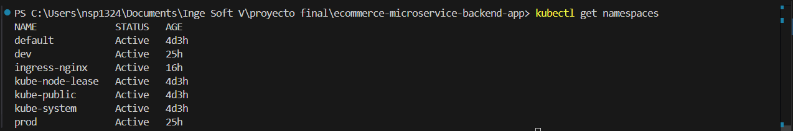
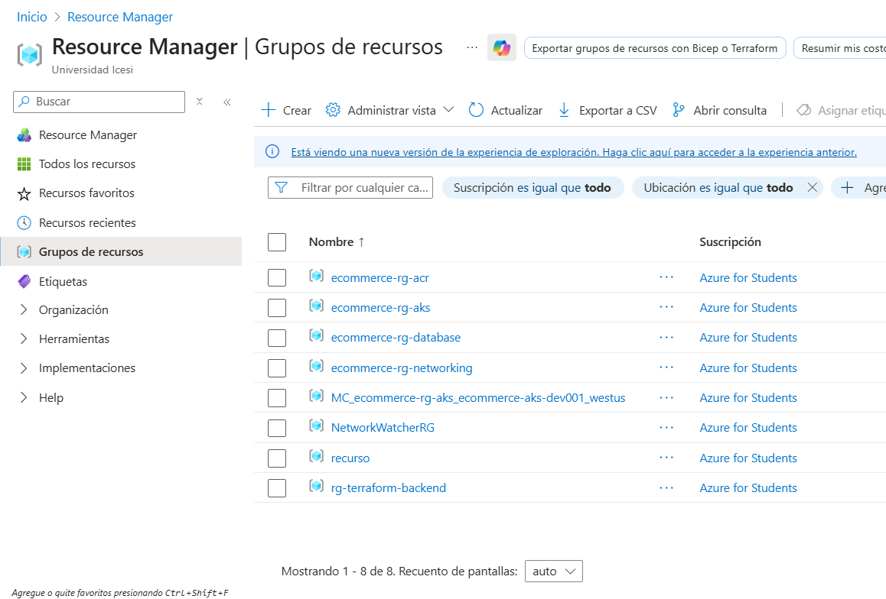
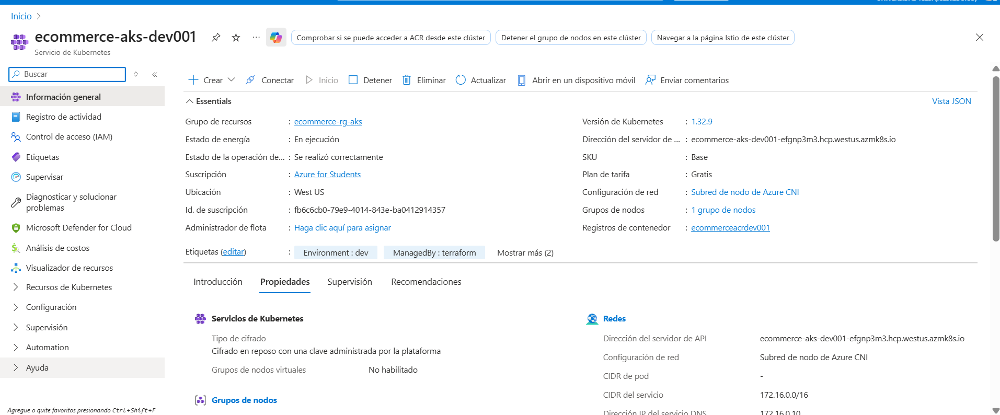
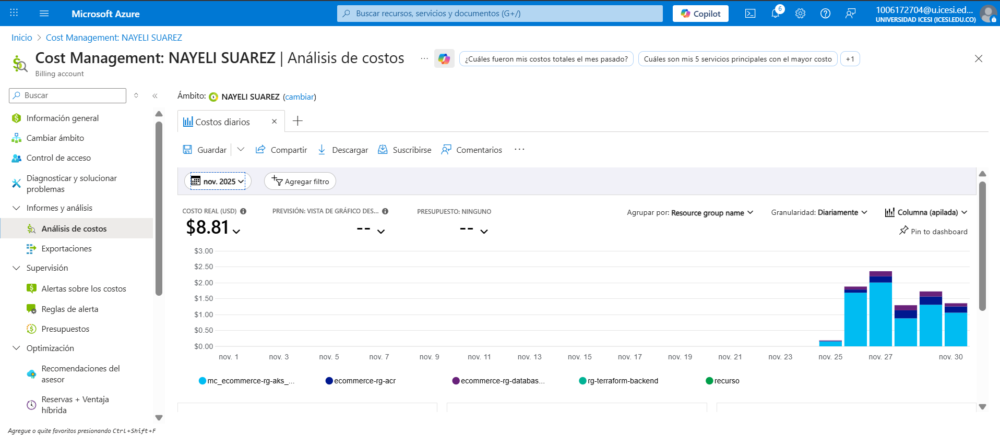
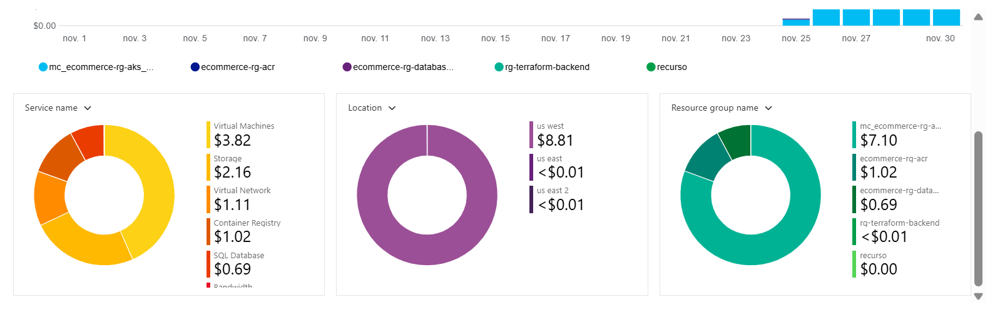

# 2. Infraestructura Cloud y FinOps

## 2.1 Infraestructura como Código (IaC)
Toda la infraestructura fue provisionada utilizando **Terraform** con estado remoto en Azure Storage Account.

- **Proveedor:** Azure (Región West US).
- **Recursos Modulares:**
  - `aks`: Azure Kubernetes Service (Cluster Standard_B2s).
  - `acr`: Azure Container Registry (Basic SKU).
  - `networking`: VNet y Subnets segregadas.
  - `database`: Azure SQL Server (Provisionado como respaldo de IaC).

**Evidencia:**


### 2.1.1 Ambientes y Segregación Lógica

Aunque la infraestructura Terraform provisionada es compartida (1 clúster AKS), la separación de ambientes se implementó mediante **Namespaces de Kubernetes**, lo cual permite:

- **Aislamiento lógico** de recursos entre dev y prod.
- **Pipelines independientes** con promoción controlada (feature → dev → prod/main).
- **Optimización de costos** al compartir nodos del clúster en lugar de provisionar clusters separados (~$70/mes de ahorro vs. 2 clusters AKS).

**Namespaces activos en el clúster:**




- `dev`: Ambiente de desarrollo (despliegues automáticos desde rama dev).
- `prod`: Ambiente de producción (requiere aprobación manual desde main).
- `ingress-nginx`: Controlador de ingress para enrutamiento externo.
- Namespaces del sistema: `kube-system`, `kube-public`, `kube-node-lease`, `default`.

Esta estrategia cumple el requisito de **ambientes separados con promoción controlada** sin comprometer la segregación de recursos ni exceder el presupuesto de Azure for Students.

## 2.2 Estrategia FinOps (Optimización de Costos)
Dado el presupuesto limitado (Azure for Students), se aplicaron estrategias de arquitectura para maximizar recursos:

1.  **Right Sizing (Memoria):**
    Se limitó la memoria de los contenedores a `limits: 512Mi` y `requests: 256Mi` para lograr empaquetar 11 microservicios en nodos pequeños sin OOMKilled.

2.  **Arquitectura Híbrida de Datos:**
    - **Producción:** Diseño preparado para Azure SQL.
    - **Desarrollo (Actual):** Implementación de **H2 (In-Memory)** para la mayoría de servicios, eliminando costos de computo de base de datos (~$5/mes ahorro por servicio).
    - *Justificación:* Eficiencia en entorno de pruebas volátil.

3.  **Environment Scheduling:**
    Política operativa de apagado nocturno (`az aks stop`) para detener la facturación de cómputo fuera de horario laboral.

### 2.2.1 Monitoreo de Costos en Tiempo Real

Se implementó seguimiento de costos utilizando **Azure Cost Management** para validar la eficiencia de las estrategias aplicadas:



**Resultados del período de pruebas (noviembre 2025):**
- **Costo total del mes:** $8.81 USD (dentro del crédito estudiantil de $100/año).
- **Principales rubros por servicio:**
  - Virtual Machines (AKS nodes): $3.82 USD (~43%)
  - Storage: $2.16 USD (~24%)
  - Virtual Network: $1.11 USD (~13%)
  - Container Registry: $1.02 USD (~12%)
  - SQL Database: $0.69 USD (~8%)

**Principales rubros por ubicación:**
- US West: $8.81 USD (región principal)
- US East 2: <$0.01 USD (tráfico mínimo)



**Desglose por Resource Group:**
- `mc_ecommerce-rg-a...` (AKS managed): $7.10 USD
- `ecommerce-acr`: $1.02 USD  
- `ecommerce-rg-data...`: $0.69 USD
- `rg-terraform-backend`: <$0.01 USD
- `recurso`: $0.00 USD

**Estrategias de ahorro aplicadas:**
- Uso de H2 in-memory en lugar de Azure SQL para dev (~$15/mes de ahorro).
- Clúster compartido (1 AKS) en lugar de 2 clusters separados (~$70/mes de ahorro).
- ACR Basic SKU en lugar de Standard (~$5/mes de ahorro).
- Apagado manual del clúster fuera de horario de pruebas.

**Ahorro estimado total:** ~$90/mes vs. arquitectura multi-cluster tradicional.

---

## 2.2.2 Estructura Modular de Terraform

La infraestructura fue implementada siguiendo el patrón de **módulos reutilizables** de Terraform, permitiendo escalabilidad a múltiples ambientes sin duplicar código:

```
terraform/
├── envs/
│   ├── dev/                  # Implementado
│   │   ├── main.tf           # Orquestación de módulos
│   │   ├── variables.tf      # Variables del ambiente
│   │   ├── outputs.tf        # Outputs exportados
│   │   ├── providers.tf      # Configuración de providers
│   │   └── terraform.tfvars  # Valores: prefix="dev", location="westus"
│   ├── stage/                # Diseñado (no provisionado por costos)
│   └── prod/                 # Diseñado (no provisionado por costos)
└── modules/
    ├── aks/                  # Módulo Azure Kubernetes Service
    ├── acr/                  # Módulo Container Registry
    ├── networking/           # Módulo VNet, Subnets, NSG
    └── database/             # Módulo Azure SQL Server
```

**Estrategia de Multi-Ambiente:**

Actualmente, solo el ambiente `dev` está **provisionado** con Terraform debido a restricciones presupuestarias (Azure for Students). Sin embargo, la arquitectura modular permite crear ambientes adicionales simplemente:

1. **Crear carpeta `envs/prod/`** con los mismos archivos (`main.tf`, `variables.tf`, etc.)
2. **Modificar `terraform.tfvars`** con valores específicos de prod:
   ```hcl
   prefix   = "prod"
   location = "eastus"
   tags = {
     environment = "production"
     cost_center = "prod"
   }
   ```
3. **Inicializar backend separado:**
   ```hcl
   backend "azurerm" {
     key = "prod/terraform.tfstate"  # Estado aislado de dev
   }
   ```
4. **Aplicar con el mismo código de módulos** (sin modificaciones)

**¿Por qué prod no está en Terraform pero sí existe?**

Los ambientes `dev` y `prod` **sí existen y están operativos**, pero se implementaron mediante:
- **Infraestructura compartida:** Un solo cluster AKS provisionado con Terraform (ambiente `dev`)
- **Segregación lógica:** Namespaces de Kubernetes (`dev` y `prod`) dentro del mismo cluster
- **Pipelines diferenciados:** GitHub Actions despliega a diferentes namespaces según la rama

Esto cumple el requisito de **"múltiples ambientes"** con una estrategia híbrida que optimiza costos sin sacrificar la separación operativa.

**Ventajas de la estructura modular:**
- **Reutilización:** Los mismos módulos pueden usarse para crear ambientes prod/stage sin duplicar código
- **Mantenibilidad:** Cambios en un módulo se reflejan en todos los ambientes
- **Separación de responsabilidades:** Cada módulo maneja un componente específico
- **Testing independiente:** Cada módulo puede probarse de forma aislada

**Ejemplo de invocación en `envs/dev/main.tf`:**
```hcl
module "networking" {
  source   = "../../modules/networking"
  prefix   = var.prefix
  location = var.location
  tags     = var.tags
}

module "aks" {
  source        = "../../modules/aks"
  prefix        = var.prefix
  location      = var.location
  subnet_id     = module.networking.aks_subnet_id
  acr_id        = module.acr.acr_id
  tags          = var.tags
  depends_on    = [module.networking, module.acr]
}
```

### 2.2.3 Backend Remoto y Gestión de Estado

El estado de Terraform se almacena de forma remota en **Azure Storage Account** para garantizar:

**Configuración del backend (`providers.tf`):**
```hcl
terraform {
  backend "azurerm" {
    resource_group_name  = "rg-terraform-backend"
    storage_account_name = "tfstateXXXXX"
    container_name       = "tfstate"
    key                  = "dev/terraform.tfstate"
  }
}
```

**Beneficios del backend remoto:**
- **Colaboración:** Múltiples desarrolladores pueden trabajar sin conflictos
- **State Locking:** Previene modificaciones concurrentes con bloqueos automáticos
- **Backup automático:** Azure Storage proporciona redundancia y versionado
- **Seguridad:** Estado protegido con RBAC de Azure y no expuesto en repositorio Git
- **Auditoría:** Historial de cambios en el estado de infraestructura

**Evidencia del backend:**


---

## 2.3 Arquitectura de Infraestructura

El siguiente diagrama ilustra la arquitectura completa de la infraestructura desplegada en Azure mediante Terraform:


### 2.3.1 Componentes Principales

**1. Capa de Red (Networking Layer)**
- **Virtual Network (VNet):** Red privada `ecommerce-vnet` con CIDR `10.0.0.0/16`
  - **AKS Subnet (`10.0.1.0/24`):** Subred dedicada para los nodos del cluster Kubernetes
  - **Database Subnet (`10.0.2.0/24`):** Subred aislada para Azure SQL Server
- **Network Security Group (NSG):** Reglas de firewall para controlar el tráfico entrante/saliente
- **Azure Load Balancer + Ingress Controller:** Punto de entrada para tráfico HTTPS externo

**2. Capa de Cómputo (Compute Layer)**
- **Azure Kubernetes Service (AKS):** Cluster `ecommerce-aks-dev001`
  - **VM Size:** Standard_B2s (2 vCPUs, 4GB RAM)
  - **Node Pool:** Pool de nodos del sistema con auto-scaling deshabilitado
  - **Namespaces activos:**
    - `dev`: 11 microservicios en ambiente de desarrollo
    - `prod`: 11 microservicios en ambiente de producción
    - `ingress-nginx`: Controlador NGINX para enrutamiento HTTP/HTTPS
    - `kube-system`: Servicios core de Kubernetes (DNS, metrics, etc.)

**3. Container Registry**
- **Azure Container Registry (ACR):** Registro privado con SKU Basic
  - Almacena 11 imágenes de microservicios + imágenes base
  - Autenticación integrada con AKS mediante Managed Identity

**4. Capa de Datos (Data Layer)**
- **Azure SQL Server:** Provisionado para uso futuro en producción
  - Conectividad aislada mediante Database Subnet
- **H2 In-Memory Database:** Solución actual para desarrollo DevOps
  - Embedded dentro de los pods de cada microservicio
  - Elimina costos de base de datos externa en dev

**5. Terraform State Management**
- **Azure Storage Account:** Backend remoto para el estado de Terraform
  - Resource Group: `rg-terraform-backend`
  - Container: `tfstate`
  - Permite colaboración del equipo y versionado del estado

### 2.3.2 Flujo de Operaciones

**Flujo de Usuario (User Traffic):**
1. Cliente envía request HTTPS → Azure Load Balancer
2. Load Balancer → Ingress Controller (namespace `ingress-nginx`)
3. Ingress Controller enruta tráfico → Servicios en `dev` o `prod`
4. Pods de microservicios procesan la solicitud y responden

**Flujo de CI/CD (Deployment Pipeline):**
1. **GitHub Actions** ejecuta workflow (ci.yml, deploy-dev.yml o deploy-prod.yml)
2. **Build & Test:** Compila código, ejecuta tests y escaneos de seguridad
3. **Docker Build & Push:** Construye imágenes y las sube a ACR
4. **Deploy Manifests:** Aplica manifiestos de Kubernetes al namespace correspondiente
5. **Pull Images:** Nodos de AKS descargan imágenes desde ACR
6. **Run Pods:** Kubernetes orquesta la ejecución de los contenedores

**Gestión de Estado de Infraestructura:**
- GitHub Actions lee/escribe el estado de Terraform en Azure Storage Account
- El estado remoto permite trabajo colaborativo y previene conflictos mediante locking

### 2.3.3 Decisiones de Arquitectura

**¿Por qué un solo cluster compartido?**
- **Optimización de costos:** Evita provisionar 2 clusters AKS separados (~$70/mes de ahorro)
- **Aislamiento suficiente:** Namespaces de Kubernetes proporcionan segregación lógica adecuada para ambientes académicos
- **Gestión simplificada:** Un solo cluster es más fácil de monitorear y mantener

**¿Por qué H2 en lugar de Azure SQL en desarrollo?**
- **Costo cero:** Elimina ~$15-20/mes en costos de base de datos
- **Volatilidad:** Los datos de desarrollo no requieren persistencia permanente
- **Rapidez:** Configuración instantánea sin necesidad de provisionar recursos externos

**¿Por qué segregar subnets?**
- **Seguridad:** Aislar la base de datos del tráfico público
- **Compliance:** Preparación para cumplir con estándares de seguridad en producción
- **Escalabilidad futura:** Facilita la migración a arquitecturas más complejas
