# 4. CI/CD Avanzado y Calidad de Código

## Tabla de Contenidos
- [4.1 Pipelines de CI/CD](#41-pipelines-de-cicd)
- [4.2 Ambientes Separados](#42-ambientes-separados)
- [4.3 Análisis Estático con SonarCloud](#43-análisis-estático-con-sonarcloud)
- [4.4 Escaneo de Vulnerabilidades con Trivy](#44-escaneo-de-vulnerabilidades-con-trivy)
- [4.5 Versionado Semántico Automático](#45-versionado-semántico-automático)
- [4.6 Notificaciones Automáticas](#46-notificaciones-automáticas)
- [4.7 Aprobaciones para Producción](#47-aprobaciones-para-producción)

---

## 4.1 Pipelines de CI/CD

### 4.1.1 Arquitectura General

Se implementaron tres pipelines en GitHub Actions que cubren el ciclo completo de integración y despliegue:

```
CI Pipeline (Todas las ramas)
    |
    +-- Build y Tests Unitarios
    +-- SonarCloud Analysis
    +-- Trivy Security Scan
    +-- Docker Image Build
    
Deploy DEV (rama: dev)
    |
    +-- Build & Push a ACR
    +-- Deploy a namespace dev
    +-- E2E Tests
    +-- OWASP ZAP Scan
    
Deploy PROD (rama: main)
    |
    +-- Build & Push a ACR
    +-- Aprobación Manual Requerida
    +-- Deploy a namespace prod
    +-- Health Checks
    +-- GitHub Release Automático
```

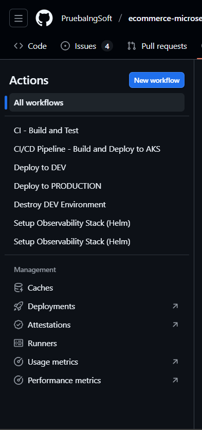

### 4.1.2 Pipeline CI (Integración Continua)

**Archivo:** `.github/workflows/ci.yml`

Ejecuta en push a cualquier rama y en pull requests. No realiza despliegues.

**Etapas principales:**

1. **Build and Test**: Compilación con Maven y ejecución de tests unitarios
2. **SonarCloud Scan**: Análisis estático de código y cobertura
3. **Trivy Scan**: Escaneo de vulnerabilidades en dependencias
4. **Docker Build**: Construcción de imágenes (sin push a registry)

```yaml
- name: SonarCloud Scan
  run: |
    mvn verify org.sonarsource.scanner.maven:sonar-maven-plugin:sonar \
      -Dsonar.projectKey=PruebaIngSoft_ecommerce-microservice-backend-app
      
- name: Run Trivy vulnerability scanner
  uses: aquasecurity/trivy-action@master
  with:
    scan-type: 'fs'
    severity: 'CRITICAL,HIGH'
```

**Evidencia requerida 2:** Ejecución exitosa del pipeline CI  
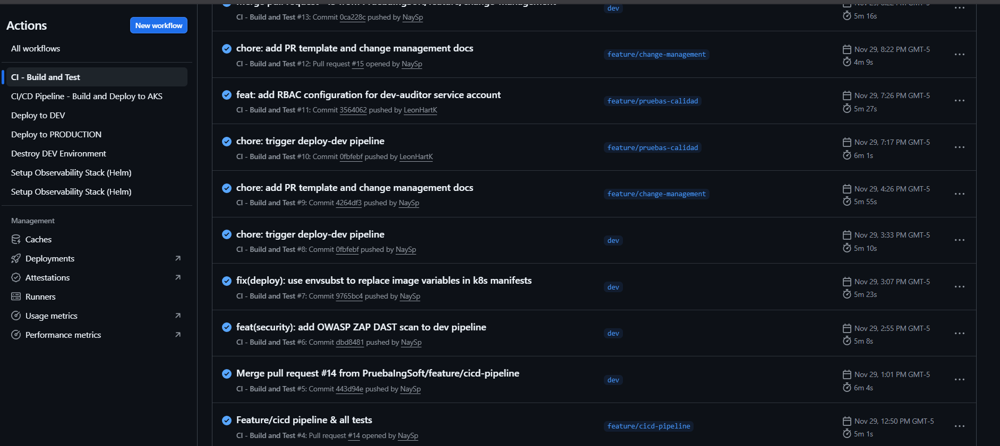
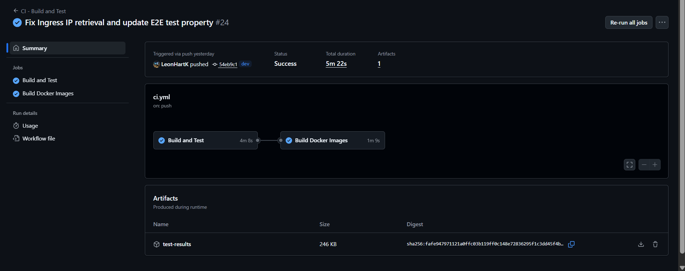


### 4.1.3 Pipeline Deploy to DEV

**Archivo:** `.github/workflows/deploy-dev.yml`

Ejecuta automáticamente al hacer push a rama `dev`.

**Jobs secuenciales:**

1. **build-and-push**: Maven build, push de imágenes a ACR con tags `<sha>` y `dev`
2. **deploy**: Despliegue a namespace `dev` en AKS, configuración de RBAC e Ingress
3. **e2e-tests**: Tests de integración end-to-end sobre ambiente desplegado
4. **security-scan-zap**: OWASP ZAP scan para pruebas DAST

**Evidencia requerida 4:** Pipeline DEV completo con los 4 jobs  
**Ubicación:** `docs/imgs/cicd/deploy-dev-pipeline.png`

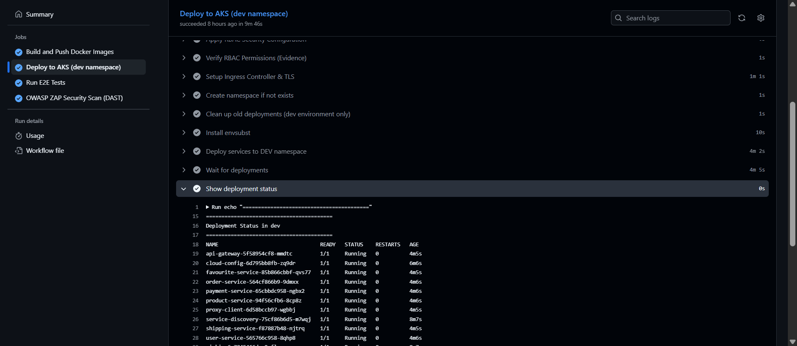


### 4.1.4 Pipeline Deploy to PRODUCTION

**Archivo:** `.github/workflows/deploy-prod.yml`

Ejecuta al hacer push a rama `main`. Incluye gate de aprobación manual.

**Características principales:**
- Requiere aprobación manual mediante GitHub Environment
- Tags de imágenes: `<commit-sha>` y `latest`
- Backup automático pre-deployment
- Health checks post-deployment
- Generación automática de GitHub Release

**Jobs secuenciales:**

1. **build-and-push**: Build y push con doble tagging
2. **deploy**: Requiere aprobación, backup, deploy a namespace `prod`, health checks
3. **notify**: Notificación del resultado
4. **create-release**: Tag git automático (formato: v2024.11.30-abc1234) y release notes

```yaml
deploy:
  environment: production  # Activa aprobación manual
  steps:
    - name: Pre-deployment backup
      run: kubectl get all -n prod -o yaml > backup.yaml
```

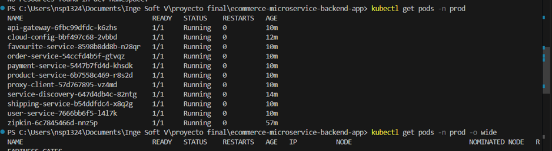

---

## 4.2 Ambientes Separados

### 4.2.1 Estrategia de Ambientes

Se implementaron dos ambientes aislados en Kubernetes mediante namespaces:

```
Namespace: dev
  - Deploy automático desde rama dev
  - Ejecución de E2E tests
  - Security scanning con OWASP ZAP
  - Base de datos de desarrollo

Namespace: prod
  - Deploy manual desde rama main
  - Aprobación obligatoria
  - Monitoreo activo
  - Base de datos de producción
```

### 4.2.2 Configuración de Namespaces

**Archivo:** `k8s/namespaces.yaml`

```yaml
apiVersion: v1
kind: Namespace
metadata:
  name: dev
  labels:
    environment: development
    monitoring: enabled
---
apiVersion: v1
kind: Namespace
metadata:
  name: prod
  labels:
    environment: production
    monitoring: enabled
    critical: "true"
```

**Evidencia requerida 8:** Namespaces en el cluster  
**Ubicación:** `docs/imgs/cicd/k8s-namespaces.png`  
**Comando:** `kubectl get namespaces --show-labels`

### 4.2.3 Configuración por Ambiente

Cada microservicio mantiene configuraciones específicas por ambiente:

```
src/main/resources/
├── application.yml          # Configuración base
├── application-dev.yml      # Desarrollo
└── application-prod.yml     # Producción
```

**Diferencias principales:**

| Configuración | DEV | PROD |
|---------------|-----|------|
| Hibernate DDL | update | validate |
| Show SQL | true | false |
| Log level | DEBUG | WARN |
| Actuator endpoints | Todos | Limitados |

**Ejemplo application-prod.yml:**
```yaml
spring:
  jpa:
    hibernate:
      ddl-auto: validate
    show-sql: false
logging:
  level:
    root: WARN
management:
  endpoints:
    web:
      exposure:
        include: health,info,metrics
```
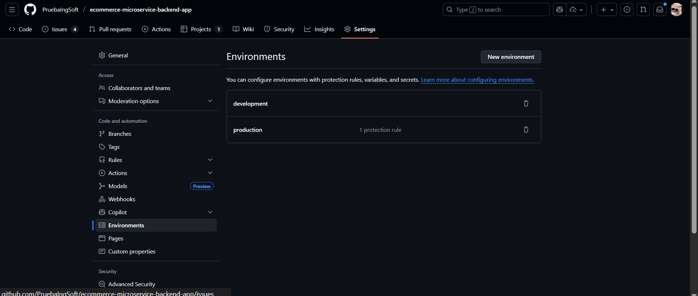

### 4.2.4 Promoción Controlada

**Flujo de promoción:**

```
Feature Branch → PR Review → Merge to dev
                               ↓
                          Deploy automático a DEV
                          E2E Tests + Security Scan
                               ↓
                          PR Review → Merge to main
                               ↓
                          Aprobación manual requerida
                               ↓
                          Deploy a PROD + Release
```

**Criterios por ambiente:**

| Criterio | DEV | PROD |
|----------|-----|------|
| Aprobación manual | No | Sí |
| Tests unitarios | Sí | Sí |
| Tests E2E | Sí | Sí |
| SonarCloud scan | Sí | Sí |
| Trivy scan | Sí | Sí |
| Code review | Recomendado | Obligatorio |

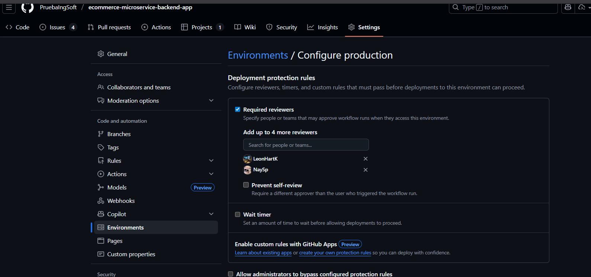

---

## 4.3 Análisis Estático con SonarCloud

### 4.3.1 Integración y Configuración

SonarCloud se ejecuta automáticamente en el pipeline CI analizando calidad de código, cobertura y vulnerabilidades.

```yaml
- name: SonarCloud Scan
  run: |
    mvn verify org.sonarsource.scanner.maven:sonar-maven-plugin:sonar \
      -Dsonar.projectKey=PruebaIngSoft_ecommerce-microservice-backend-app
```

**Quality Gates configurados:**
- Coverage mínimo: 60%
- Duplicación máxima: 3%
- Ratings mínimos: A (Maintainability, Reliability, Security)
- Security Hotspots: 100% revisados

**Evidencia requerida 11:** Dashboard de SonarCloud con Quality Gate status  
**Ubicación:** `docs/imgs/cicd/sonarcloud-overview.png`

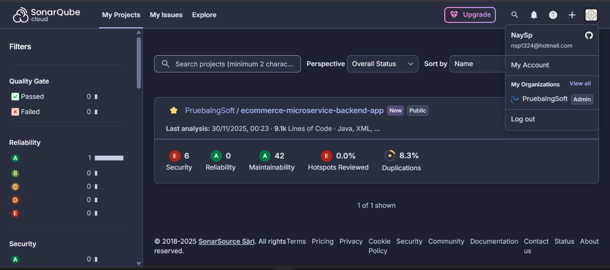
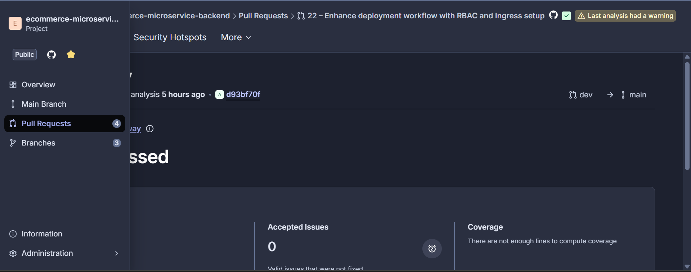

### 4.3.2 Métricas Principales

**Análisis automático de:**
- **Reliability:** Bugs clasificados por severidad
- **Security:** Vulnerabilidades y hotspots de seguridad
- **Maintainability:** Code smells y technical debt
- **Coverage:** Cobertura de tests unitarios
- **Duplications:** Código duplicado

**Integración con Pull Requests:**

SonarCloud comenta automáticamente en cada PR con el análisis completo:
```
Quality Gate: Passed
Coverage: 68.5%, Bugs: 0, Vulnerabilities: 0
```
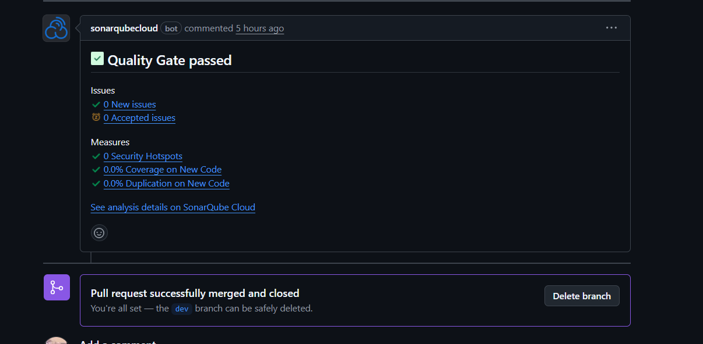
---

## 4.4 Escaneo de Vulnerabilidades con Trivy

### 4.4.1 Implementación

Trivy escanea dependencias y código en busca de vulnerabilidades conocidas (CVEs).

```yaml
- name: Run Trivy vulnerability scanner
  uses: aquasecurity/trivy-action@master
  with:
    scan-type: 'fs'
    severity: 'CRITICAL,HIGH'
```

**Categorías analizadas:**
- Dependencias de Maven (pom.xml)
- Librerías con CVEs conocidos
- Paquetes del sistema operativo en imágenes Docker

**Severidades monitoreadas:**
- CRITICAL: Vulnerabilidades críticas explotables
- HIGH: Vulnerabilidades de alto impacto

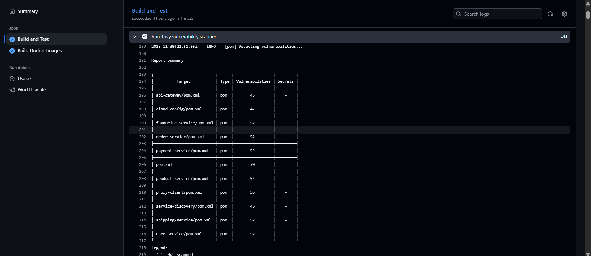


A pesar de que Trivy detectó 573 vulnerabilidades distribuidas en los archivos pom.xml del proyecto, siendo el principal factor el uso de Spring Boot 2.5.7 (versión de 2021). Estas vulnerabilidades provienen principalmente de dependencias transitivas con CVEs conocidos que han sido corregidos en versiones posteriores del framework. La detección exitosa de estas vulnerabilidades demuestra la efectividad de Trivy como herramienta de análisis de seguridad en el pipeline CI/CD, permitiendo identificar riesgos antes del despliegue.
### 4.4.2 Proceso de Remediación

**Flujo de resolución:**
1. Trivy detecta vulnerabilidad en pipeline
2. Se evalúa severidad y disponibilidad de fix
3. Se actualiza dependencia en pom.xml
4. Se ejecutan tests de regresión
5. Se valida con nuevo escaneo

**Ejemplo de actualización:**
```xml
<dependency>
    <groupId>org.springframework</groupId>
    <artifactId>spring-core</artifactId>
    <version>5.3.27</version>
</dependency>
```


## 4.5 Versionado Semántico Automático

### 4.5.1 Estrategia de Versionado

**Formato implementado:**
```
v{YYYY}.{MM}.{DD}-{SHORT_SHA}
Ejemplo: v2024.11.30-a1b2c3d
```

**Generación automática en deploy-prod.yml:**
```yaml
- name: Generate version tag
  run: |
    VERSION="v$(date +'%Y.%m.%d')-${GITHUB_SHA::7}"
    git tag -a $VERSION -m "Release $VERSION"
    git push origin $VERSION
```
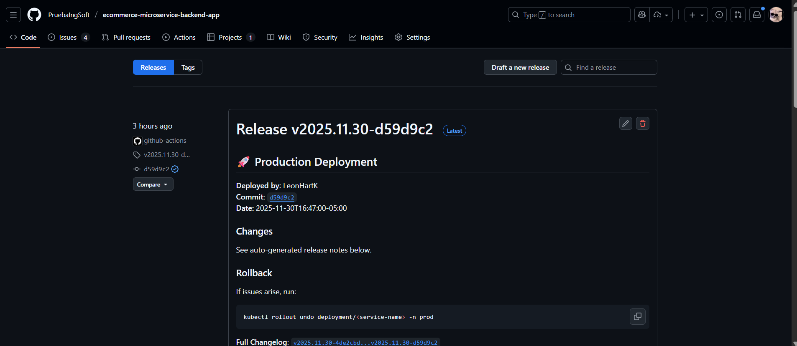

### 4.5.2 Tags en Docker Images

**Estrategia por ambiente:**
- **DEV:** `<commit-sha>` y `dev`
- **PROD:** `<commit-sha>` y `latest`

```yaml
for service in $SERVICES; do
  docker build -t $REGISTRY/$service:$TAG .
  docker tag $REGISTRY/$service:$TAG $REGISTRY/$service:$TAG_LATEST
  docker push $REGISTRY/$service:$TAG
  docker push $REGISTRY/$service:$TAG_LATEST
done

```
### 4.5.3 GitHub Releases Automáticos

Cada deployment a producción genera un release con notas automáticas:

```yaml
- name: Create GitHub Release
  uses: softprops/action-gh-release@v1
  with:
    tag_name: ${{ steps.version.outputs.VERSION }}
    generate_release_notes: true
```

## 4.6 Notificaciones Automáticas

### 4.6.1 Notificaciones Nativas de GitHub

GitHub Actions envía notificaciones por email automáticamente cuando:
- Un workflow falla
- Un workflow requiere aprobación
- Un workflow es cancelado

**Configuración:** GitHub Profile → Settings → Notifications → Actions


### 4.6.2 Job de Notificación en Pipeline

```yaml
notify:
  name: Notify Deployment
  needs: deploy
  if: always()
  steps:
    - name: Deployment Summary
      run: |
        if [ "${{ needs.deploy.result }}" == "success" ]; then
          echo "Production deployment completed successfully"
        else
          echo "Production deployment failed"
        fi
```

### 4.6.3 Status Badges

Badges en README.md para visibilidad del estado:

```markdown


```

**Evidencia requerida 23:** README con badges  
**Ubicación:** `docs/imgs/cicd/github-badges.png`

---

## 4.7 Aprobaciones para Producción

### 4.7.1 Configuración de GitHub Environment

**Pasos de configuración:**
1. Settings → Environments → New environment: `production`
2. Configurar Protection Rules:
   - Required reviewers (mínimo 1)
   - Deployment branches: solo `main`
   - Wait timer (opcional)

### 4.7.2 Implementación en Pipeline

```yaml
deploy:
  name: Deploy to PRODUCTION
  environment: production  # Activa aprobación manual
  steps:
    - name: Deploy to AKS
      run: kubectl apply -f k8s/ -n prod
```

**Flujo de aprobación:**
1. Merge a main dispara workflow
2. Job build-and-push ejecuta automáticamente
3. Job deploy espera aprobación
4. Reviewer aprueba mediante interfaz de GitHub
5. Deploy continúa automáticamente


### 4.7.3 Historial y Rollback

**Visualizar historial:**
- Settings → Environments → production → Deployment history

**Procedimiento de rollback:**
```bash
# Ver historial
kubectl rollout history deployment/<service> -n prod

# Rollback a versión anterior
kubectl rollout undo deployment/<service> -n prod

# Verificar estado
kubectl rollout status deployment/<service> -n prod
```
---

## 4.8 Métricas de CI/CD

### 4.8.1 KPIs Monitoreados

| Métrica | Objetivo | Actual |
|---------|----------|--------|
| **Deployment Frequency** | Diario | Calculado en base a commits |
| **Lead Time for Changes** | < 1 hora | Tiempo desde commit hasta prod |
| **Mean Time to Recovery (MTTR)** | < 30 minutos | Rollback manual en K8s |
| **Change Failure Rate** | < 15% | Basado en rollbacks |
| **Pipeline Success Rate** | > 85% | Calculado semanalmente |

**📸 PANTALLAZO REQUERIDO #32:**
- **Ubicación:** `docs/imgs/cicd/07-approvals/workflow-insights.png`
- **Contenido:** GitHub Insights de workflows
- **Cómo obtenerlo:**
  1. Ve a Actions
  2. Selecciona un workflow
  3. Click en "..." → "View workflow insights"
  4. Captura mostrando:
     - Success rate
     - Average duration
     - Runs per week

### 4.8.2 Tiempo de Ejecución

**Duraciones Promedio:**

```
CI Pipeline:          ~8-10 minutos
  ├─ Build & Test:    5 min
  ├─ SonarCloud:      2 min
  ├─ Trivy Scan:      1 min
  └─ Docker Build:    2 min

Deploy DEV:           ~15-20 minutos
  ├─ Build & Push:    8 min
  ├─ Deploy:          5 min
  ├─ E2E Tests:       3 min
  └─ ZAP Scan:        4 min

Deploy PROD:          ~12-15 minutos
  ├─ Build & Push:    8 min
  ├─ Deploy:          5 min
  ├─ Verification:    2 min
  └─ Create Release:  1 min
```
## 4.9 Sintesis de Implementación

- [x] **Pipelines Completos**
  - [x] CI Pipeline (build, test, scan)
  - [x] Deploy to DEV (auto)
  - [x] Deploy to PROD (manual approval)

- [x] **Ambientes Separados**
  - [x] Namespace `dev` configurado
  - [x] Namespace `prod` configurado
  - [x] Configs por ambiente (application-{env}.yml)
  - [x] Promoción controlada entre ambientes

- [x] **SonarQube/SonarCloud**
  - [x] Integración en CI pipeline
  - [x] Quality Gates configurados
  - [x] Análisis en PRs
  - [x] Métricas de calidad visibles

- [x] **Trivy**
  - [x] Filesystem scan en CI
  - [x] Container image scan
  - [x] Detección de CRITICAL y HIGH vulnerabilities
  - [x] Reportes en artefactos

- [x] **Versionado Semántico**
  - [x] Tags automáticos: v{YYYY}.{MM}.{DD}-{SHA}
  - [x] Tags en Docker images: SHA + environment
  - [x] GitHub Releases auto-generados
  - [x] Release notes automáticas

- [x] **Notificaciones**
  - [x] Email nativo de GitHub Actions
  - [x] Job de notificación en workflows
  - [x] Badges en README
  - [ ] Slack/Teams (opcional, documentado)

- [x] **Aprobaciones**
  - [x] GitHub Environment "production"
  - [x] Required reviewers configurados
  - [x] Workflow bloqueado hasta aprobación
  - [x] Historial de deployments
  - [x] Procedimiento de rollback documentado

### Para Troubleshooting

```bash
# Ver logs de un pod
kubectl logs <pod-name> -n prod

# Describir pod con problemas
kubectl describe pod <pod-name> -n prod

# Ver eventos del namespace
kubectl get events -n prod --sort-by='.lastTimestamp'

# Ver rollout history
kubectl rollout history deployment/<service> -n prod

# Hacer rollback
kubectl rollout undo deployment/<service> -n prod
