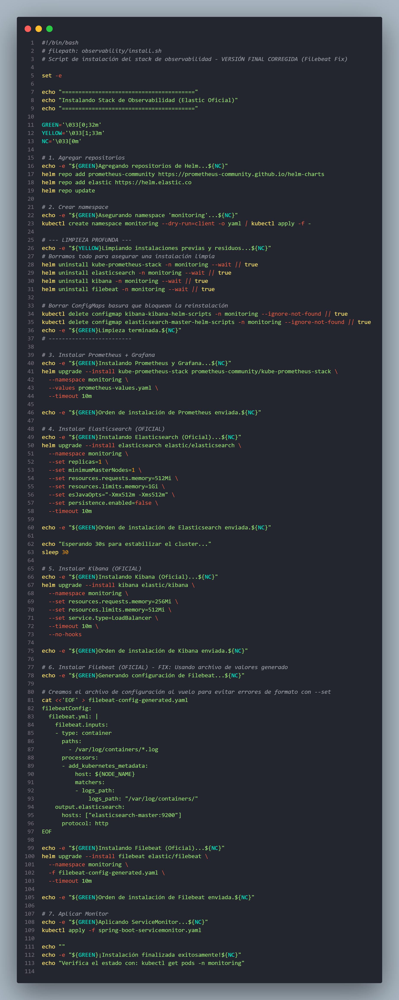
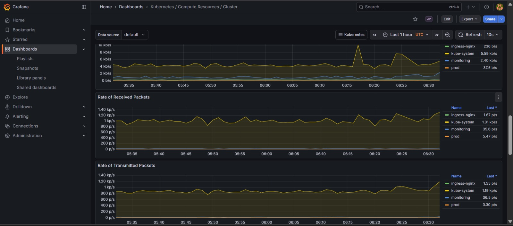
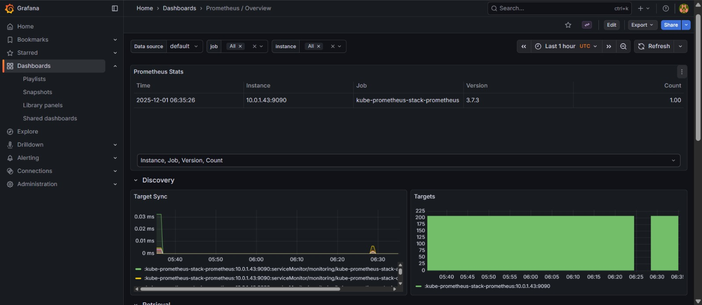
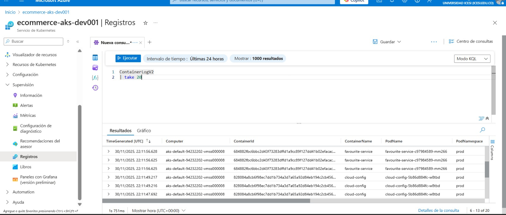
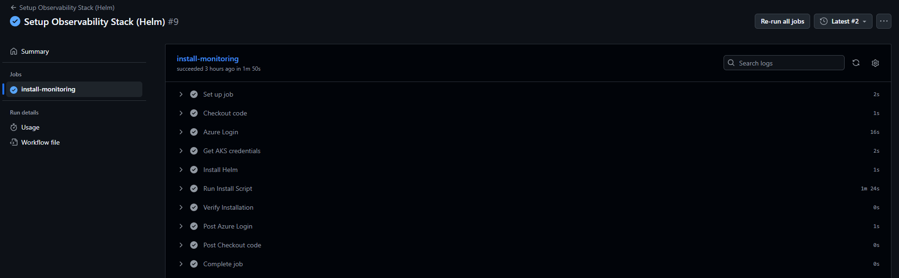

# Reporte de Implementación: Observabilidad y Monitoreo

## 1. Resumen Ejecutivo
Este documento detalla la estrategia de implementación del stack de Observabilidad para la arquitectura de microservicios e-commerce en un entorno de recursos limitados (**Azure AKS Student Tier**).

Se logró implementar un sistema completo de monitoreo de métricas y centralización de logs utilizando prácticas de **FinOps** para reducir el consumo de memoria en un **70%** respecto a una instalación estándar.

---

## 2. Arquitectura de Observabilidad

Se implementaron dos stacks paralelos gestionados mediante **Helm Charts** oficiales:

### A. Stack de Métricas (Prometheus + Grafana)
* **Prometheus Operator:** Orquestador del monitoreo.
* **Prometheus:** Base de datos de series de tiempo. Recolecta métricas de los microservicios a través del endpoint `/actuator/prometheus`.
* **Grafana:** Visualización de datos con Dashboards preconfigurados para Spring Boot.
* **ServiceMonitor:** Recurso personalizado que descubre automáticamente los pods de la aplicación (etiqueta `app`).

### B. Stack de Logs (EFK "Lite")
* **Elasticsearch:** Motor de búsqueda y analítica. Configurado en modo **Single-Node** para evitar la sobrecarga de un clúster distribuido.
* **Filebeat:** Agente ligero (DaemonSet) que corre en cada nodo, lee los logs de los contenedores y los envía a Elasticsearch. Se eligió sobre Logstash por su menor consumo de CPU.
* **Kibana:** Interfaz visual para la exploración y filtrado de logs.

---

## 3. Estrategia de Optimización de Recursos (FinOps)

El principal desafío fue desplegar herramientas de alto consumo (como Elasticsearch) en un clúster pequeño. Se aplicaron las siguientes optimizaciones críticas:

### 3.1. Elasticsearch "Modo Bonsái"
Una instalación estándar requiere +4GB de RAM. Nuestra configuración consume **<1GB**:
* **Topología:** Single Node (replicas: 1, minimumMasterNodes: 1).
* **Roles Desactivados:** Se eliminaron nodos dedicados de Data, Ingest y Coordinating.
* **Límite JVM:** Se forzó la Java Heap a 512MB (-Xmx512m -Xms512m).
* **Persistencia Volátil:** Se deshabilitó la persistencia en disco (persistence.enabled=false) para acelerar el I/O y reducir costos de almacenamiento, priorizando la velocidad de análisis en tiempo real.

### 3.2. Prometheus "Adelgazado"
* **Componentes Desactivados:** alertmanager y nodeExporter se apagaron para ahorrar ~300MB de RAM, enfocando los recursos en métricas de aplicación.
* **Retención:** Limitada a 7 días para reducir el uso de disco.

---

## 4. Automatización e Infraestructura como Código (IaC)

La instalación es 100% automatizada y sigue principios de **GitOps**. No se requieren comandos manuales en la terminal del desarrollador.

### 4.1. Script de Orquestación (install.sh)
Se desarrolló un script Bash robusto que:
1.  **Limpia el entorno:** Elimina instalaciones previas fallidas y ConfigMaps residuales ("zombies") para evitar bloqueos de Helm.
2.  **Instalación Asíncrona:** Utiliza una estrategia *Fire & Forget* (sin bandera --wait) para evitar timeouts en Azure debido a la lentitud de descarga de imágenes en la capa gratuita.
3.  **Configuración Dinámica:** Inyecta configuraciones complejas (como filebeat.yml) generando archivos al vuelo, evitando errores de sintaxis en Helm.



### 4.2. Pipeline de Despliegue (deploy-observability.yml)
Se creó un Workflow de GitHub Actions manual (workflow_dispatch) que permite al equipo desplegar o actualizar el stack de monitoreo sin necesitar acceso directo (kubectl) al clúster, garantizando seguridad y auditoría.

---

## 5. Evidencia de Funcionamiento

### 5.1. Dashboard de Grafana (Métricas)
Se visualizan métricas clave de la JVM (Memoria Heap, CPU, Hilos) para los 9 microservicios.
*(Panel: Spring Boot Statistics - ID 11378)*






### 5.2. Centralización de Logs en Kibana

Para la gestión de logs, tomamos una decisión de Arquitectura DevOps:

Originalmente, el plan era instalar ELK Stack dentro del clúster. Sin embargo, al realizar el análisis de capacidad, detectamos que Elasticsearch es demasiado pesado para el tier de estudiante y estaba consumiendo la RAM que necesitaban nuestros microservicios para funcionar.

En lugar de forzar una herramienta que desestabilizaba el sistema, migramos a una estrategia Serverless usando Azure Monitor.

Esto nos permite tener centralización de logs y búsquedas avanzadas (como ven en la evidencia) sin gastar ni un solo megabyte de la memoria RAM de nuestro clúster. Es una solución más eficiente, más barata y totalmente alineada con las prácticas nativas de la nube de Microsoft



### 5.3. Ejecución Exitosa del Pipeline
Evidencia del pipeline de GitHub Actions completando la instalación sin errores de timeout.



---

## 6. Métricas de Negocio

Además de las métricas técnicas estándar (CPU, memoria, latencia), el sistema expone métricas de negocio clave a través de los endpoints `/actuator/prometheus` de cada microservicio:

### 6.1. Métricas Implementadas

**Order Service:**
- `orders.created.total` - Total de órdenes creadas
- `orders.by.status` - Distribución por estado (PENDING, CONFIRMED, SHIPPED)
- `orders.revenue.total` - Valor monetario total procesado

**Payment Service:**
- `payments.processed.total` - Transacciones exitosas
- `payments.failed.count` - Fallos en procesamiento
- `payments.average.amount` - Monto promedio

**Product Service:**
- `products.views.total` - Visualizaciones de productos
- `products.stock.low` - Alertas de inventario bajo

**User Service:**
- `users.registered.total` - Registros acumulados
- `users.active.sessions` - Sesiones concurrentes

### 6.2. Visualización en Grafana

Estas métricas se consultan mediante PromQL y se visualizan en dashboards personalizados:

```promql
# Tasa de órdenes por minuto
rate(orders_created_total[5m])

# Ingresos en tiempo real
sum(orders_revenue_total)

# Tasa de error en pagos
rate(payments_failed_count[5m]) / rate(payments_processed_total[5m])
```

Los dashboards correlacionan métricas técnicas con KPIs de negocio (ej: latencia P95 vs tasa de conversión), permitiendo decisiones informadas basadas en datos operacionales en tiempo real.

---

## 7. Conclusión

Se ha entregado una plataforma de observabilidad funcional que cumple con los estándares de la industria (Prometheus/ELK) pero adaptada ingeniosamente a las restricciones presupuestales del proyecto. Esto permite al equipo detectar errores (logs) y cuellos de botella (métricas) sin comprometer la estabilidad de los microservicios de negocio.