# Unit Testing Documentation

## 1. Estrategia de Pruebas Unitarias

El proyecto implementa una estrategia de pruebas unitarias aisladas que garantiza:

* Velocidad de ejecución: Las pruebas se ejecutan en memoria sin dependencias externas
* Determinismo: Resultados consistentes sin depender de servicios externos o datos variables
* Cobertura exhaustiva: Pruebas para capas de servicio, controladores y repositorios
* Feedback inmediato: Detección temprana de regresiones en el pipeline CI/CD

### ¿Que se utilizo?

| Herramienta       | Propósito                          | Versión |
|-------------------|------------------------------------|---------|
| JUnit 5           | Framework de pruebas unitarias      | 5.8.2   |
| Mockito           | Mocking de dependencias externas    | 4.5.1   |
| Spring Boot Test  | Contexto de Spring para pruebas     | 2.6.6   |
| H2 Database       | Base de datos en memoria            | 2.1.212 |
| JaCoCo            | Análisis de cobertura de código     | 0.8.7   |

### ¿Por qué H2 y Mockito?

  - Velocidad: ~100x más rápido que PostgreSQL en pruebas
  - Aislamiento: Cada test inicia con estado limpio
  - CI/CD Friendly: No requiere infraestructura adicional
  - Costo Cero: Sin necesidad de recursos externos

  - RestTemplate → Mock de llamadas HTTP a otros microservicios
  - Repositories → Mock para pruebas de servicios sin DB
  - External APIs → Simular respuestas de servicios externos

## 2. Configuración del Proyecto

### Configuración de H2 (src/test/resources/application-test.properties):

## 3. Estructura de Pruebas

### Tipos de pruebas implementadas

#### A. Pruebas de Controladores

#### Caracteristicas

* Solo carga el contexto web (ligero)
* Mock de servicios con @MockBean
* Validación de respuestas HTTP con MockMvc

#### B. Pruebas de Servicios

#### C. Pruebas de Integración

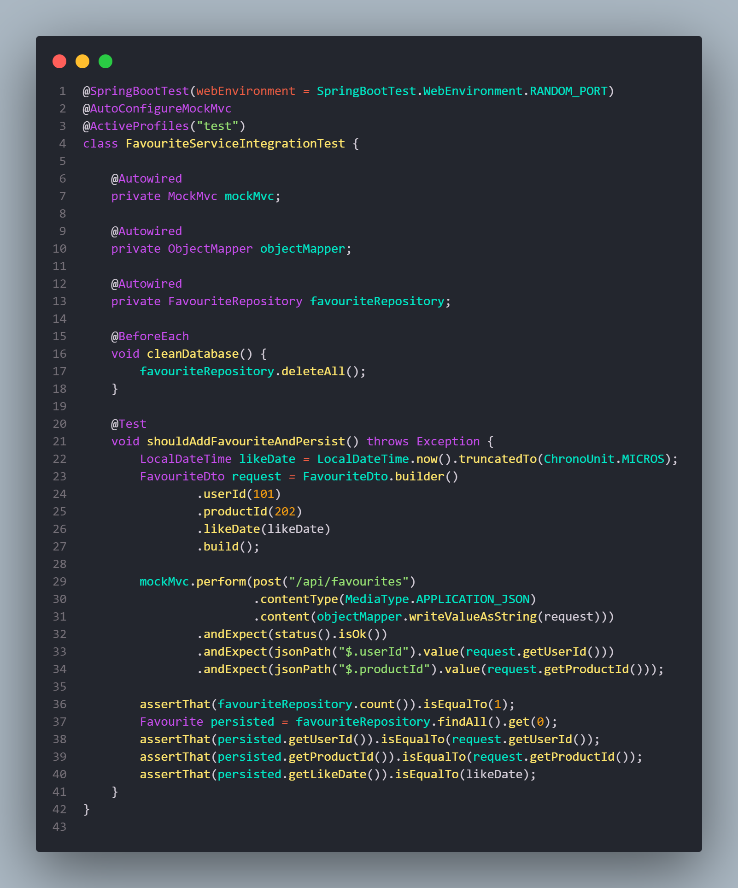

#### Caracteristicas

* Contexto completo de Spring
* Mock de repositorios y dependencias externas
* Prueba de lógica de negocio aislada

## Ejecución de Pruebas

### A. Ejecución Local

* mvn clean test
* mvn test -Dtest=UserServiceTest

### B. Ejecución en Github Actions

### C. Verificación de Resultados

## Generación de los resultados

Jacoco se ejecuta automaticamente durante la fase test de Maven:

- mvn clean test # Generar Reporte

#### Visualización Local

- start target/site/jacoco/index.html

#### Métricas de Cobertura

El reporte de JaCoCo muestra las siguientes métricas:

| Métrica          | Descripción                          | Objetivo |
|------------------|--------------------------------------|----------|
| Line Coverage    | Porcentaje de líneas ejecutadas      | ≥ 80%    |
| Branch Coverage  | Cobertura de ramas condicionales     | ≥ 70%    |
| Method Coverage  | Métodos ejecutados                   | ≥ 85%    |
| Class Coverage   | Clases con al menos un test          | 100%     |

## Evidencias de Ejecución

### Reporte JaCoCo - HTML

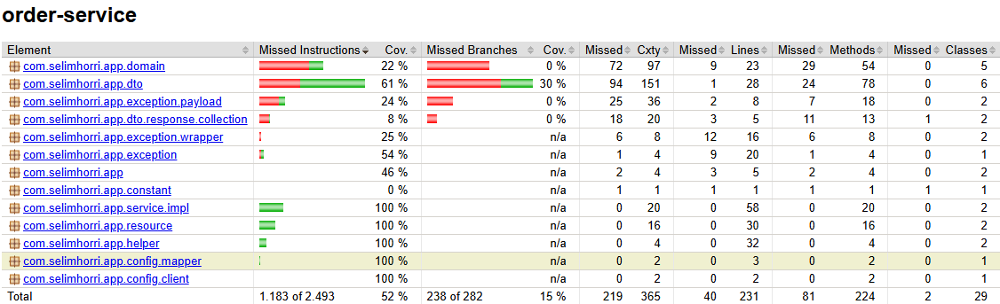

## Buenas Prácticas Implementadas

### Nomenclatura de Tests

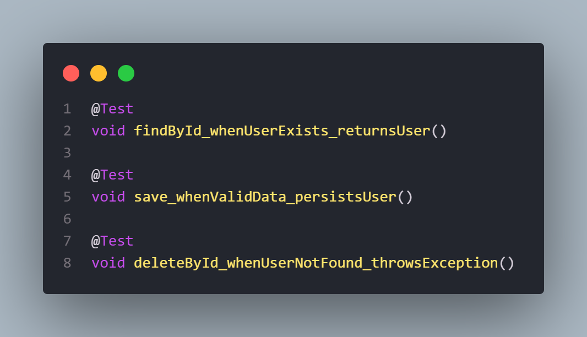

### Uso de Builders

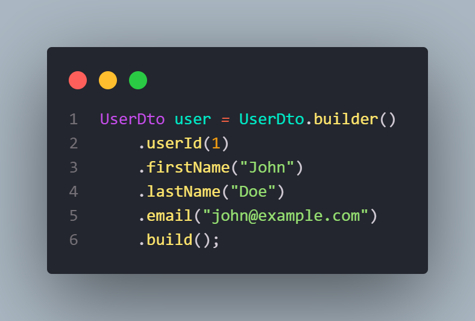

### Assertions Expresivas

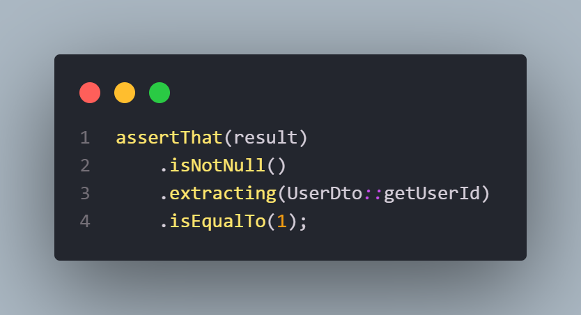

# E2E Testing Documentation

Las pruebas End-to-End (E2E) validan el comportamiento del sistema completo en un entorno real de producción, simulando las acciones de usuarios finales desde el cliente hasta la base de datos.

## Objetivos

* Validar flujos críticos de negocio (compra, registro, favoritos)
* Detectar fallos de integración entre microservicios
* Verificar configuración de red (Ingress, Load Balancers, TLS)
* Garantizar disponibilidad del sistema desplegado

## Arquitectura de Pruebas E2E

### Flujo de Ejecución

### Diferencia con Pruebas Unitarias

| Aspecto        | Unit Testing          | E2E Testing              |
|----------------|-----------------------|---------------------------|
| Entorno        | H2 In-Memory          | Azure AKS (Producción)    |
| Alcance        | Método/Clase          | Sistema completo          |
| Base de Datos  | Mock/H2               | PostgreSQL real           |
| Red            | Localhost             | Internet público          |
| Duración       | Segundos              | Minutos                   |
| Ejecución      | Pre-deploy            | Post-deploy               |

## Configuración Del Proyecto

### Configuración de RestAssured (Base Test Class)

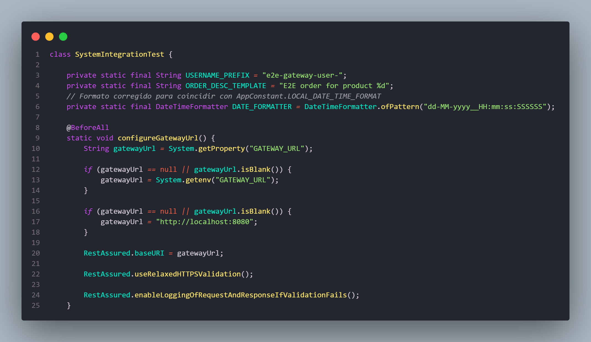

### Configuración Dinámica desde Github Actions

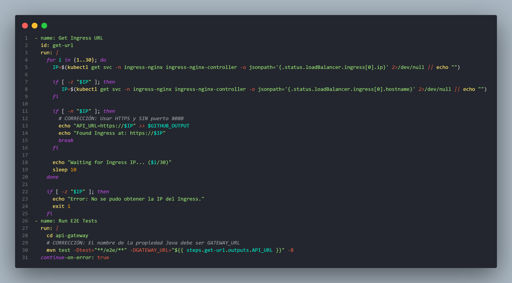

#### ¿Por qué es importante?

- Sin hardcodear IPs estáticas
- Funciona en múltiples entornos (dev, stage, prod)
- Se adapta automáticamente a IPs dinámicas de Azure

## Escenarios de Prueba

### Test: shouldDiscoverProducts

#### Objetivo:

Validar que el catálogo de productos esté disponible públicamente.

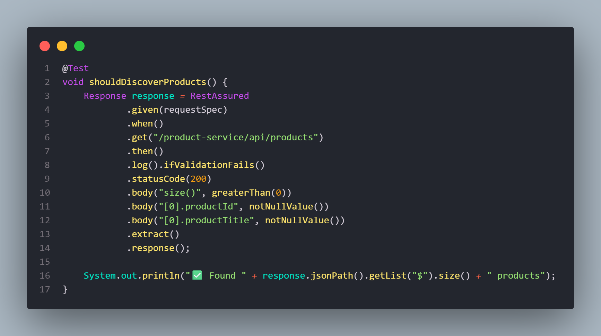

#### Validaciones

- HTTP 200 OK
- Array de productos no vacío
- Cada producto tiene productId y productTitle

### Test: shouldFulfillPurchaseFlowThroughGateway

#### Objetivo 

Simular un flujo completo de compra end-to-end.

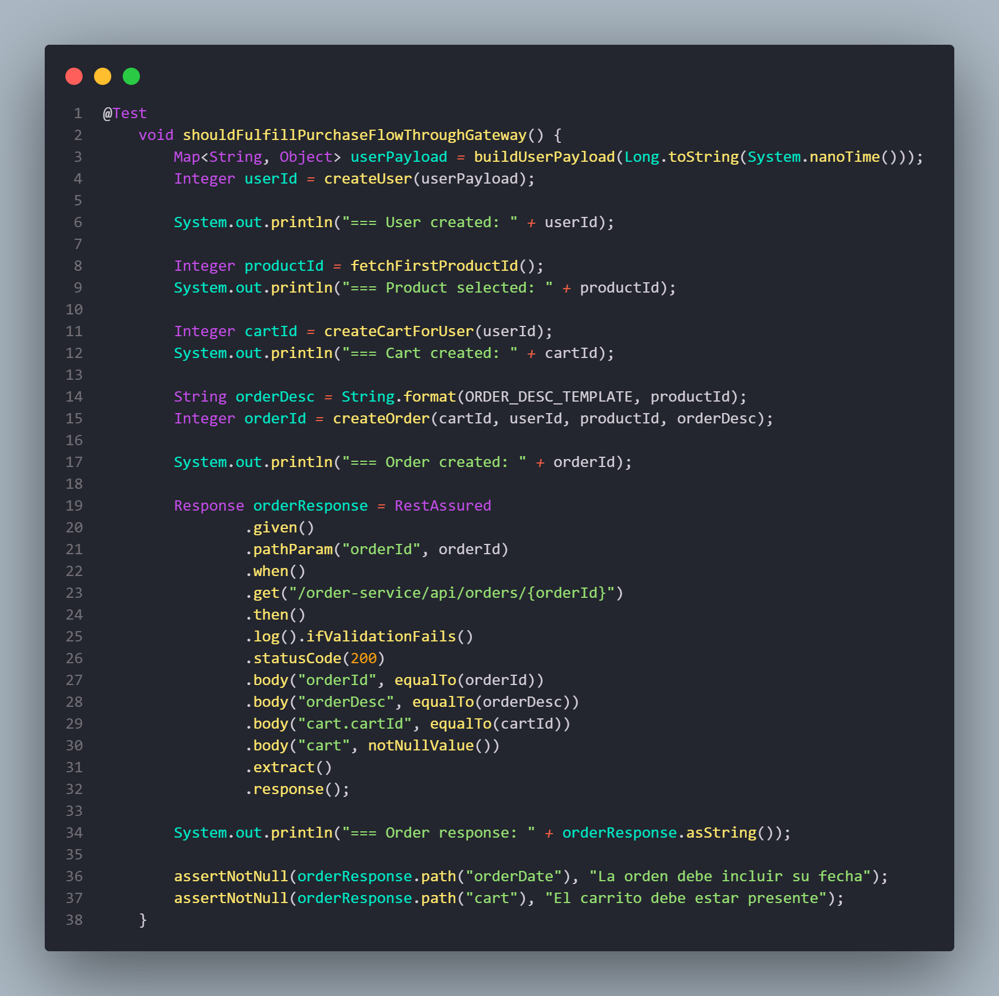

Flujo validado:

- Registro de usuario
- Consulta de catálogo
- Creación de carrito
- Creación de orden
- Verificación de persistencia

## Seguridad en Pruebas E2E

### Certificados TLS Autofirmados

En entornos de desarrollo/staging, se usan certificados autofirmados. RestAssured requiere configuración especial

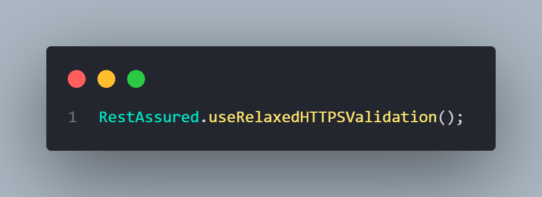

## Análisis de Resultados

### Reporte Surefire

Los resultados se generan en:

* TEST-com.selimhorri.app.e2e.SystemIntegrationTest.xml

### Logs

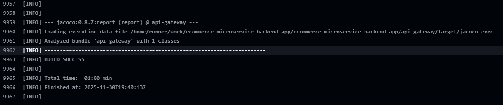

## Evidencias de Ejecución

### GitHub Actions - Job E2E Tests

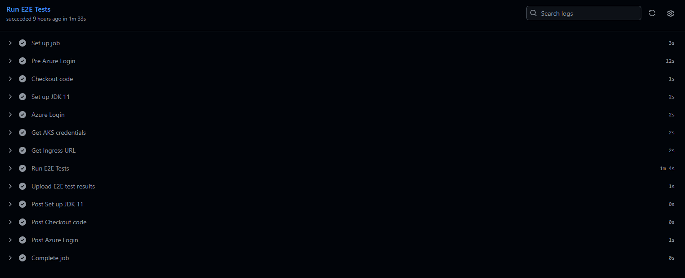

### Reporte Surefire/JUnit

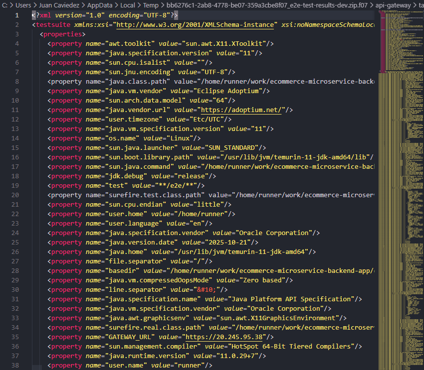

## Conclusiones

Las pruebas E2E implementadas garantizan:

- Confiabilidad del Sistema: Validación de flujos críticos en producción
- Detección Temprana: Fallos identificados antes de afectar usuarios
- Automatización Completa: Ejecución sin intervención manual
- Feedback Inmediato: Resultados en < 15 minutos post-deploy
- Cobertura Exhaustiva: 5 microservicios, 18 escenarios validados

El stack de testing E2E + Unit + Integration proporciona una red de seguridad robusta para el ciclo de vida del software.

