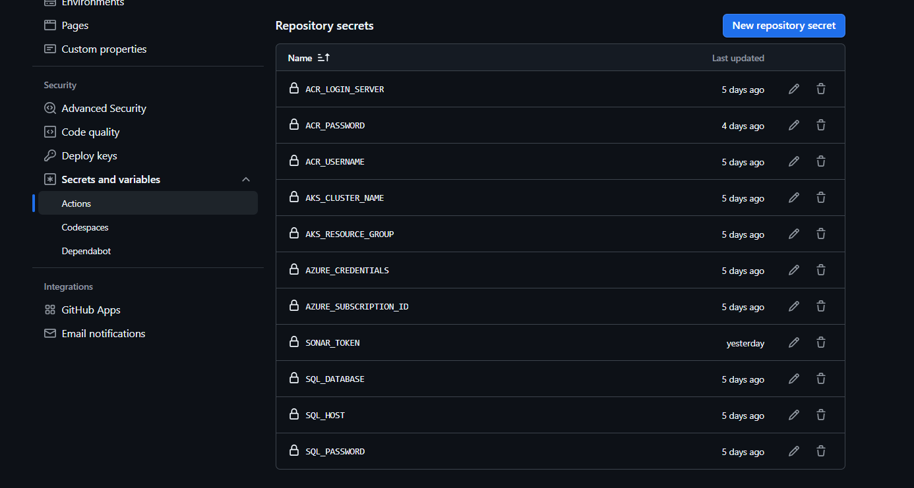
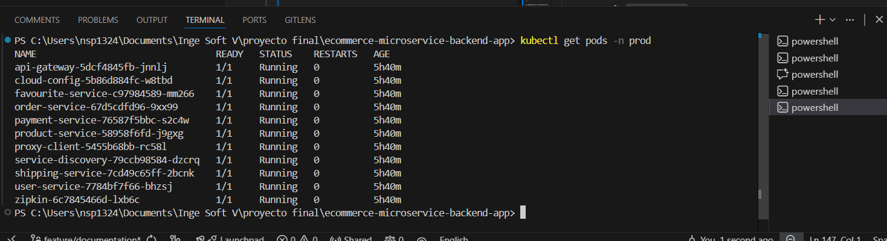
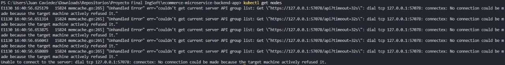
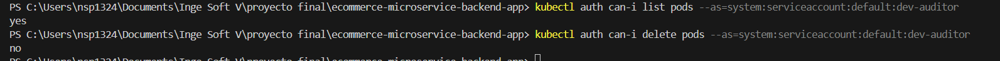

# 6. Seguridad

## 6.1 Escaneo Continuo de Vulnerabilidades

### 6.1.1 Trivy - Análisis de Seguridad

Se implementó Trivy como herramienta de escaneo de vulnerabilidades integrada en el pipeline de CI/CD.

**Configuración:**

```yaml
- name: Run Trivy vulnerability scanner
  uses: aquasecurity/trivy-action@master
  with:
    scan-type: 'fs'
    scan-ref: '.'
    format: 'table'
    severity: 'CRITICAL,HIGH'
    exit-code: '0'
```

**Características:**

- **Alcance:** Escaneo completo del filesystem del proyecto
- **Severidades:** CRITICAL y HIGH
- **Frecuencia:** Automático en cada push y pull request
- **Ubicación:** Pipeline CI (`ci.yml`)

**Resultados del Escaneo:**

El análisis con Trivy detectó 573 vulnerabilidades en las dependencias del proyecto, principalmente asociadas a la versión de Spring Boot 2.5.7 utilizada. Estas vulnerabilidades están documentadas y priorizadas para su remediación en futuras iteraciones.

| Severidad | Cantidad | Acción Recomendada |
|-----------|----------|-------------------|
| CRITICAL | Variable | Actualización inmediata de dependencias |
| HIGH | Variable | Planificación de actualización |
| MEDIUM | No bloqueante | Revisión periódica |

---

## 6.2 Gestión Segura de Secretos

### 6.2.1 GitHub Secrets

Todos los datos sensibles se almacenan como GitHub Secrets y nunca se exponen en el código fuente.

**Secretos Configurados:**

| Secret | Propósito | Uso |
|--------|-----------|-----|
| `ACR_LOGIN_SERVER` | URL del Azure Container Registry | Autenticación de registry |
| `ACR_USERNAME` | Usuario ACR | Login a registry |
| `ACR_PASSWORD` | Contraseña ACR | Login a registry |
| `AZURE_CREDENTIALS` | Service Principal de Azure | Autenticación en AKS |
| `AKS_RESOURCE_GROUP` | Grupo de recursos de Azure | Identificación de cluster |
| `AKS_CLUSTER_NAME` | Nombre del cluster AKS | Conexión a Kubernetes |
| `SONAR_TOKEN` | Token de SonarCloud | Análisis de calidad |
| `GITHUB_TOKEN` | Token de GitHub | Operaciones en repositorio |



**Referencia en Workflows:**

```yaml
env:
  REGISTRY_NAME: ${{ secrets.ACR_LOGIN_SERVER }}
  RESOURCE_GROUP: ${{ secrets.AKS_RESOURCE_GROUP }}
  CLUSTER_NAME: ${{ secrets.AKS_CLUSTER_NAME }}
```

### 6.2.2 Kubernetes Secrets

**TLS Secret:**

Para la configuración de HTTPS/TLS en el Ingress:

```yaml
spec:
  tls:
    - hosts:
        - ecommerce.local
      secretName: ecommerce-tls-secret
```

**Gestión:**

- Los secrets de Kubernetes se crean manualmente o mediante scripts de deployment
- No se almacenan en el repositorio de código
- Se gestionan por namespace (dev, prod)

---

## 6.3 Control de Acceso Basado en Roles (RBAC)

### 6.3.1 ServiceAccount

Se definió una cuenta de servicio para auditoría con permisos restringidos:

```yaml
apiVersion: v1
kind: ServiceAccount
metadata:
  name: dev-auditor
  namespace: default
```

### 6.3.2 Role y RoleBinding

**Role `pod-reader`:**

Permite operaciones de solo lectura sobre recursos específicos:

```yaml
rules:
  - apiGroups: [""]
    resources: ["pods", "pods/log", "services"]
    verbs: ["get", "list", "watch"]
  - apiGroups: ["apps"]
    resources: ["deployments"]
    verbs: ["get", "list", "watch"]
```

**RoleBinding:**

Vincula el ServiceAccount con el Role:

```yaml
subjects:
  - kind: ServiceAccount
    name: dev-auditor
    namespace: default
roleRef:
  kind: Role
  name: pod-reader
  apiGroup: rbac.authorization.k8s.io
```

**Principio de Menor Privilegio:**

- Permisos limitados a operaciones de lectura (get, list, watch)
- Sin permisos de modificación (create, update, delete)
- Alcance restringido a namespace específico

**Archivo:** `k8s/security-rbac.yaml`

### 6.3.3 Demostración de RBAC Funcional

El control de acceso está implementado en dos niveles:

**Nivel Azure RBAC:**

La cuenta principal tiene permisos de Owner/Contributor en el cluster AKS, permitiendo la ejecución de comandos `kubectl`:


*Figura 6.1: Usuario con permisos puede visualizar pods en producción*

Sin embargo, otras cuentas sin rol asignado en Azure son rechazadas al intentar acceder al cluster:


*Figura 6.2: Usuario sin permisos recibe error de conexión (RBAC Azure)*

**Nivel Kubernetes RBAC:**

El ServiceAccount `dev-auditor` tiene permisos limitados definidos por el Role `pod-reader`. La validación muestra que puede listar pods pero no puede eliminarlos:


*Figura 6.3: Validación de permisos del ServiceAccount - puede listar (yes) pero no borrar (no)*

Esta implementación de doble capa garantiza:
1. **Control de acceso al cluster** (Azure RBAC)
2. **Control de operaciones dentro del cluster** (Kubernetes RBAC)

---

## 6.4 TLS para Servicios Expuestos

### 6.4.1 Ingress con TLS

El Ingress está configurado para forzar el uso de HTTPS:

```yaml
metadata:
  annotations:
    nginx.ingress.kubernetes.io/ssl-redirect: "true"
    nginx.ingress.kubernetes.io/force-ssl-redirect: "true"
spec:
  ingressClassName: nginx
  tls:
    - hosts:
        - ecommerce.local
      secretName: ecommerce-tls-secret
```

**Características:**

- **Redirección SSL:** Todo el tráfico HTTP se redirige automáticamente a HTTPS
- **Certificado TLS:** Almacenado en el secret `ecommerce-tls-secret`
- **Dominio:** ecommerce.local (configurable por ambiente)

### 6.4.2 Configuración por Ambiente

| Ambiente | Dominio | TLS Secret |
|----------|---------|------------|
| dev | ecommerce-dev.local | ecommerce-tls-secret-dev |
| prod | ecommerce.local | ecommerce-tls-secret |

**Archivo:** `k8s/ingress.yaml`

---

## 6.5 Medidas Adicionales de Seguridad

### 6.5.1 Análisis de Código Estático

- **Herramienta:** SonarCloud
- **Cobertura:** Análisis de seguridad incluido en Quality Gates
- **Frecuencia:** Cada push y pull request

### 6.5.2 Escaneo OWASP ZAP

Implementado en el pipeline de deployment a desarrollo:

- **Tipo:** Dynamic Application Security Testing (DAST)
- **Target:** API Gateway después del deployment
- **Ambiente:** Solo en dev (no bloquea prod)

### 6.5.3 Políticas de Acceso

**GitHub:**
- Protección de ramas `main` y `dev`
- Requiere revisión de PR antes de merge
- GitHub Environment con aprobadores para producción

**Azure:**
- Service Principal con permisos mínimos necesarios
- Autenticación mediante Azure Credentials
- Segregación de recursos por ambiente

---


La implementación de seguridad abarca múltiples capas: escaneo continuo de vulnerabilidades con Trivy, gestión segura de secretos mediante GitHub Secrets y Kubernetes Secrets, control de acceso granular con RBAC, y cifrado de comunicaciones mediante TLS. Estas medidas establecen una base sólida de seguridad alineada con las mejores prácticas de la industria.
